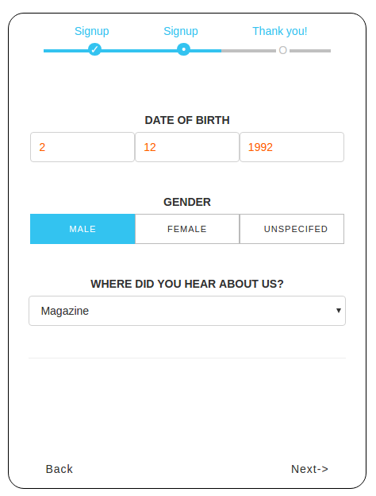

# React-MultiStep

## About
Using React.js and React-Multistep, I created the SignUp page 
This React-MultiStep example is written by [Big Silver].

## install and run

- Open termianl `git clone https://github.com/Big-Silver/React-Multistep.git react-multistep`
- Move to the project `cd react-multistep`
- Run `npm install`
- Then run `npm run example`
- Then go to `http://localhost:8080/webpack-dev-server/src/examples/index.html` in your browser

## tests
- tests are written in the mocha, chai, sinon, enzyme stack
- located in the 'tests' folder and supports es6
- run the `npm run test` command run tests
- run the `npm run test:watch` command run test in watch mode

## code test coverage
- test coverage is done via istanbul
- run the `npm run test:coverage` command to generate full coverage report (shown in terminal and as lcov report in coverage directory)
- all code is run against coverage, not just the unit tested modules
- test coverage improvement is currently a work in progress

